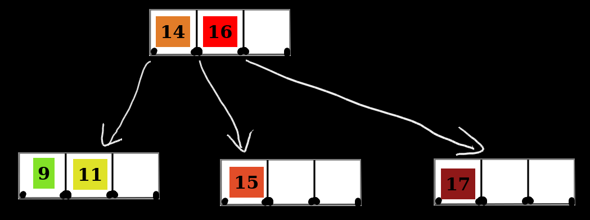

# tableaunoir

Tableaunoir means blackboard in french. Tableaunoir is an online blackboard tool.

## Features

* Draw in white, orange, blue!
* Erase
* Objects like fridge magnets that you can move on the board, to make animation e.g. for illustrating sorting algorithms, etc.

## Galery

## Future features (to be implemented)

* Share the screen online (but you can actually do it via Discord, Zoom etc.)
* More magnets
* Multiple persons that can edit

