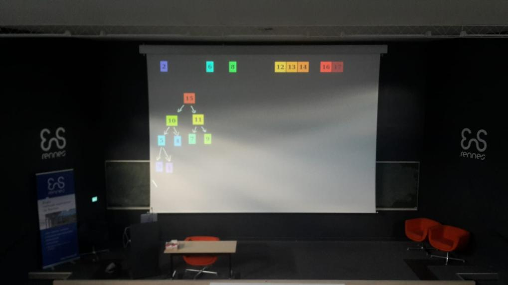
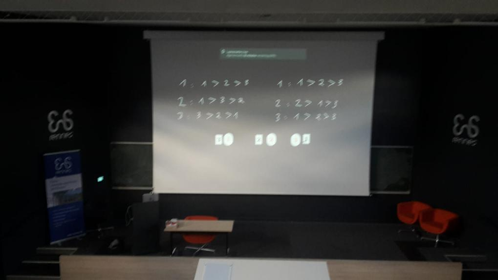
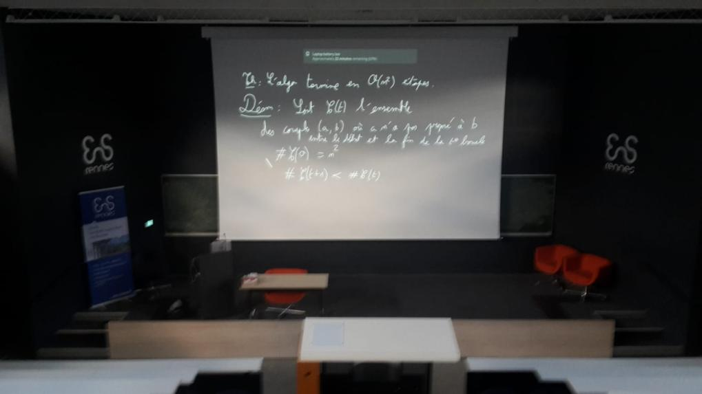
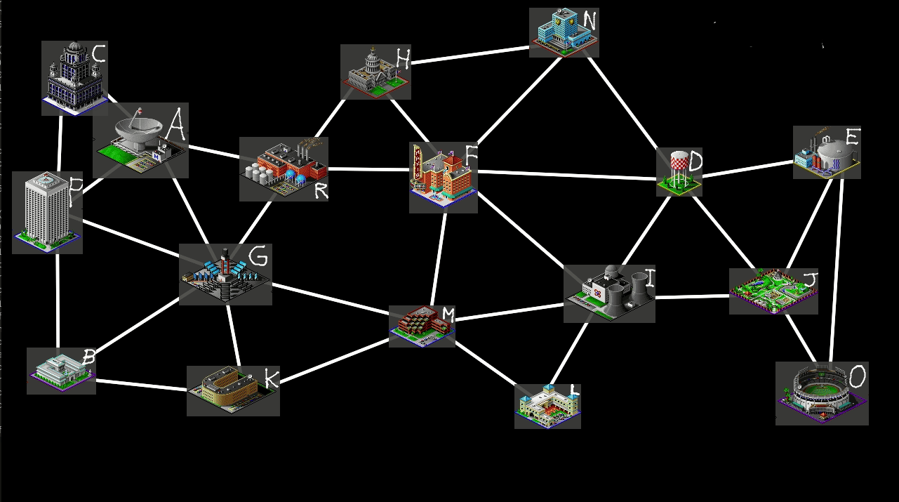
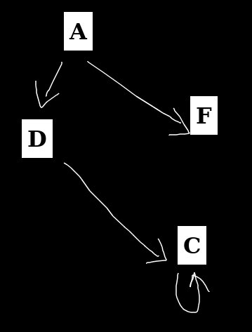
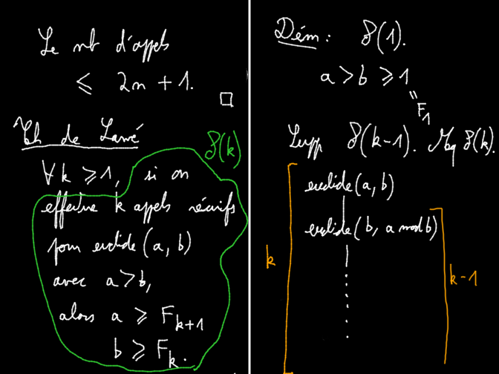

# tableaunoir

Tableaunoir is an online blackboard tool. It can be used as a traditional blackboard but you can also create interactive animations via the use of "fridge magnets".
["Tableau noir" means blackboard in french](https://www.deepl.com/translator#fr/en/Tableau noir).
The online version is available here: [https://tableaunoir.github.io/] ([another one](http://tableaunoir.irisa.fr)


## Video

[https://www.youtube.com/watch?v=P6_lhqiPBow] (in French)


## Examples of use

Tableaunoir is used for teaching at ENS Rennes. The main advantage is that the screen is fully black: there are no buttons that annoy or distract the students (in my personal use, I simply hide the toolbar). Tableaunoir is controlled by a graphic tablet and by the keyboard of the computer (7 keys!). It makes it very interactive compared to fixed slides. 

### Photos in a lecture hall

  

### Example of a course



## Features

* Of course, you can draw and erase, with your mouse or a graphic tablet.
* You can also use kind of predefined fridge magnets that you can move on the board, to make animation e.g. for illustrating sorting algorithms, graphs algorithms etc (and even playing Go!).
* Create your own customized "fridge magnets" for interactive courses, by importing any image.
* Color palette for chalk (`c`, 7 colors  black/white , yellow , orange , blue , red , pink , green ),
* Change the color of magnets' background,
* Load/Save the current board,
* Add texts (`Enter` and type), and move texts,
* Switch to a whiteboard instead of a blackboard,
* Collaborate and edit the same board at the same time (need a server for that),
* Change from right-handed (default) to left-handed cursor,
* Add as many new half-board as you need, going right with `→` and then left/right with `←/→` keyboard arrows.

You can teach online by sharing the screen with Discord, Zoom, Teams, etc, or by sharing a link (need a server for that).

## Screenshots

     

---

## Offline version

If you prefer to use an offline version, it is possible. You have to install [Electron](https://www.electronjs.org/) and then the application can be launched as follows (from the main directory):

```bash
$ electron mainElectron.js
```

## Create your own tableaunoir server

In order to share blackboards, you need a server. 
In the server, first `git clone` (and then later `git pull`) the project. Modify the variable `SERVERADRESS` in `js/share.js` to be the address of your server (eg `1.2.3.4`). Install Apache HTTPD to deploy `index.html` (other web servers might work too, but have not been tested).
Install the dependencies for the server, see [`server/INSTALL.md`](server/INSTALL.md).
Then `server/run.sh`.

---

## [License](https://github.com/tableaunoir/tableaunoir.github.io/blob/master/LICENSE)
This software is open-source under [the GPLv3.0 license](https://github.com/tableaunoir/tableaunoir.github.io/blob/master/LICENSE).

## Credits
- Some pictures come from [@nicholas-ochoa/OpenSC2K](https://github.com/nicholas-ochoa/OpenSC2K), an open-source clone of Sim City 2000.
