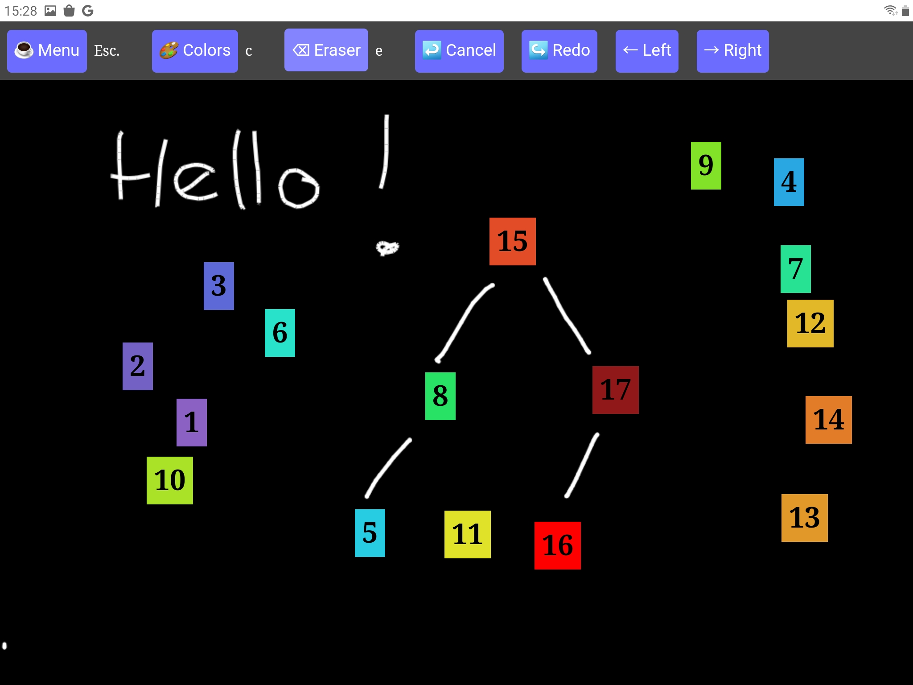
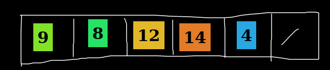
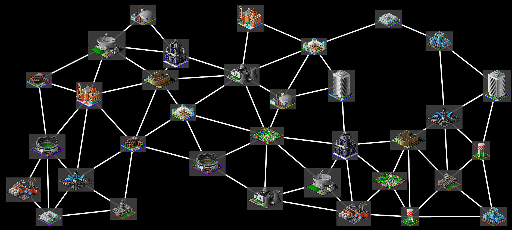
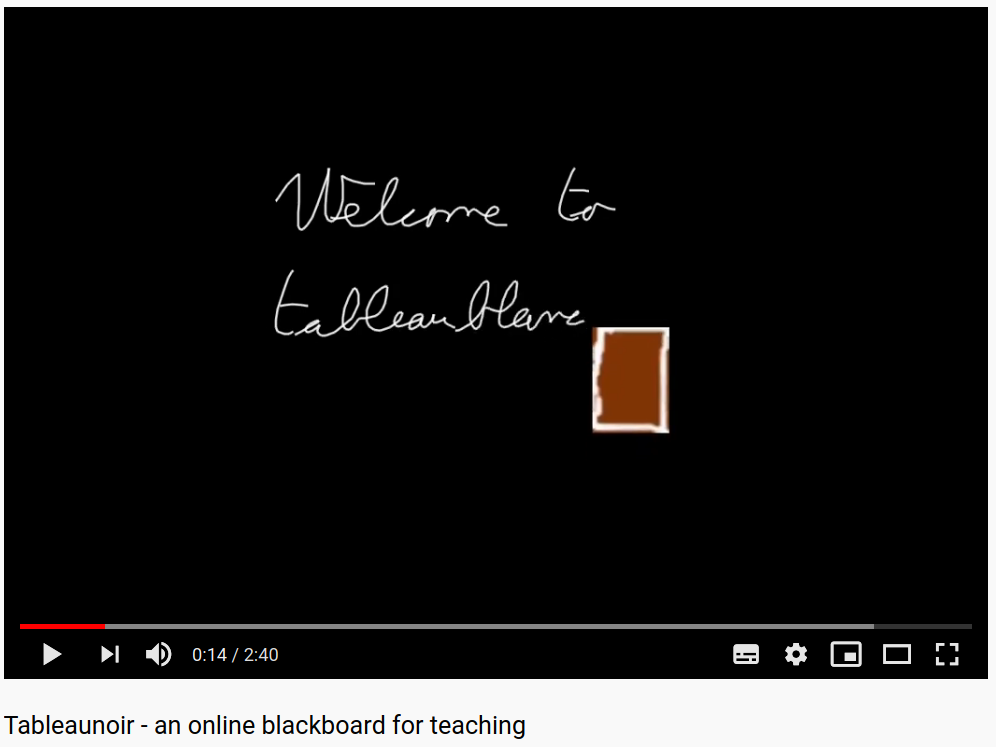

<h1 align="center">Tableaunoir</h1>

  https://tableaunoir.github.io/

Tableaunoir is  an <b>online collaborative blackboard</b> tool with <b>fridge magnets</b> available in <b>many languages</b>. ["Tableau noir" means blackboard in French](https://www.deepl.com/translator#fr/en/Tableau%20noir). Contrary to plenty of other collaborative boards on the Internet, with Tableaunoir  you can create <b>interactive animations</b> via the use of <b>fridge magnets</b>. The full documentation is available [here](https://github.com/tableaunoir/documentation).

## Screenshots

Tableaunoir has been designed to give lectures. Tableaunoir enables to easily divide your board in panels and navigate panel by panel.

Tableaunoir offers **magnets**, like fridge magnets. They are small images, numbers, texts. The user can add/move/delete magnets to create animations. The screenshot below shows the use of magnets when teaching algorithms in a computer science curriculum. In the examples below, magnets data in some data structure, nodes in some graph, etc.

   

## Features

We list the main features of Tableaunoir.
* Of course, you can draw and erase, with your mouse or a graphic tablet. You can draw shapes.
* **Collaborate** edit the same board at the same time (need a server for that),
* **does not require an account** 
* Backgrounds: staffs for **teaching music**, grid, images and **PDF documents**
* You can also use kind of **predefined fridge magnets** that you can move on the board, to make animation e.g. for illustrating sorting algorithms, graphs algorithms etc (and even playing Go!).
* **Create your own fridge magnets** for interactive courses, by importing any image, or by transforming a part of the board (Ctrl + X).
* Color palette for chalk (`c`, 7 colors  black/white , yellow , orange , blue , red , pink , green ),
* **Draw interative graphs** : vertices are magnets, labels of vertices and edges are handwritten but are updated when vertices are moved,
* Change the color of magnets' background,
* Load/Save the current board,
* Export in PNG or PDF,
* Add texts (`Enter` and type), and move texts. Supports **LaTeX** (using [MathJax](https://www.mathjax.org/))!
* Switch to a **whiteboard** instead of a blackboard, or any background color
* Change from right-handed (default) to **left-handed** cursor,
* **Divide yourboard in half**. Ideal for teaching. Add as many new half-board as you need, going right with `→` and then left/right with `←/→` keyboard arrows,
* Make **slides**, record **animations**. This can be used to prepare slides for a talk or for a video.

You can teach online by sharing the screen with Discord, Zoom, Teams, etc, or by sharing a link (need a server for that).

## Videos

- Video in english: [https://www.youtube.com/watch?v=BtLaNBOuSHc]
- First video in french:
[https://www.youtube.com/watch?v=P6_lhqiPBow]

## Examples of use

### Give a lecture

Tableaunoir is **used for teaching** at ENS Rennes. The main advantage is that, by hiding the toolbar, the **screen is fully black**: there are no buttons that annoy or distract the students (in my personal use, I simply hide the toolbar). Tableaunoir is controlled by a graphic tablet and by the keyboard of the computer (7 keys!). It makes it very interactive compared to fixed slides. 

  

### Share ideas

An idea to explain and share? Tableaunoir enables to write together on shared collaborative boards.

### Draw pictures

Tableaunoir can simply be used to draw pictures: [https://team.inria.fr/erable/en/marie-france-sagot/blog/silly-things/]

### Make slides for videos or presentation

Tableaunoir can also be used to build slides. See the [documentation](https://github.com/tableaunoir/documentation).

---

#### Developer options

See [developer options](developeroptions.md)

## [License](https://github.com/tableaunoir/tableaunoir.github.io/blob/master/LICENSE)
This software is open-source under [the GPLv3.0 license](https://github.com/tableaunoir/tableaunoir.github.io/blob/master/LICENSE).

## Credits
Thank you to all contributors. Also thank you for your support. Please find the list of the source of the images.

- Some pictures come from [@nicholas-ochoa/OpenSC2K](https://github.com/nicholas-ochoa/OpenSC2K), an open-source clone of Sim City 2000.
- [https://openmoji.org/]
- Some CC0 icons from [https://www.svgrepo.com/]
- The sound of the chalk comes from [https://lasonotheque.org/detail-0541-craie-sur-tableau-noir.html]
- [https://upload.wikimedia.org/wikipedia/commons/3/38/Icon_pdf_file.svg]
- [https://pxhere.com/en/photo/1057578]
